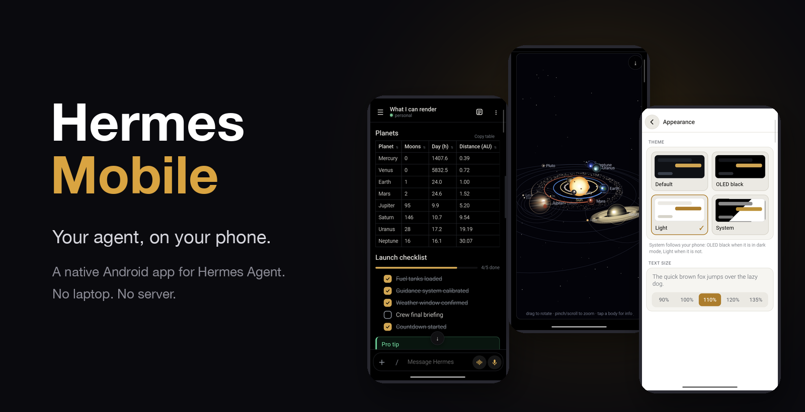
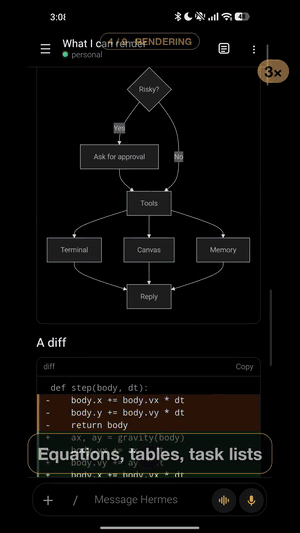
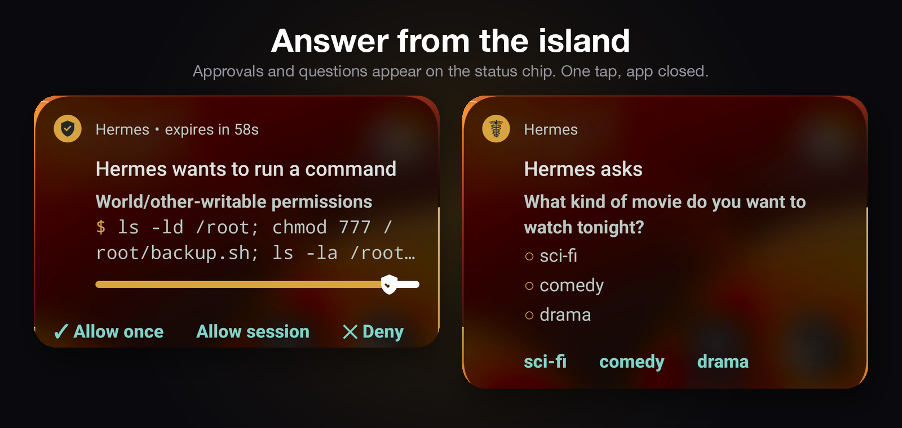
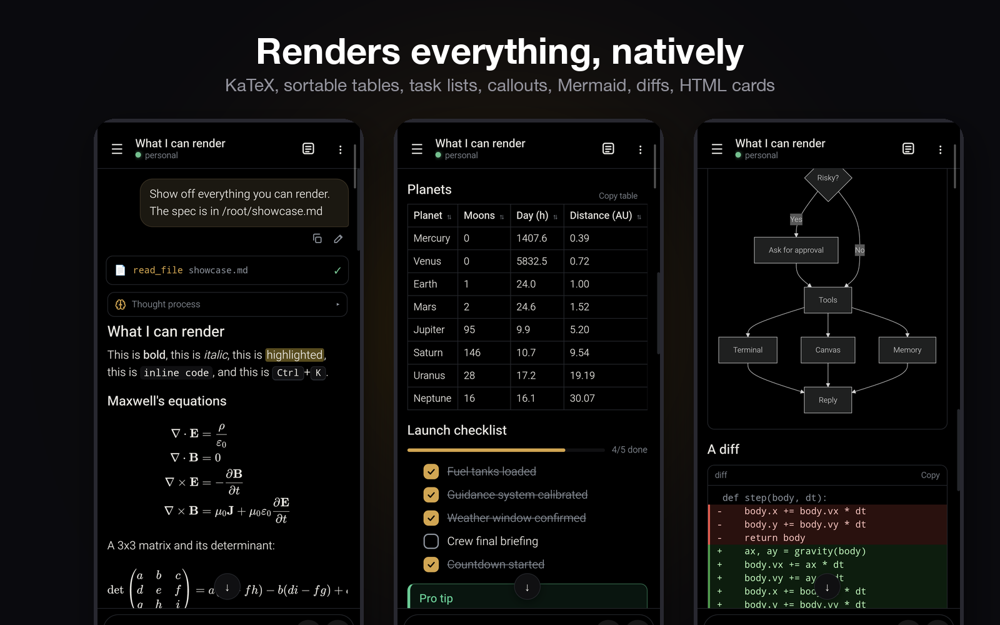
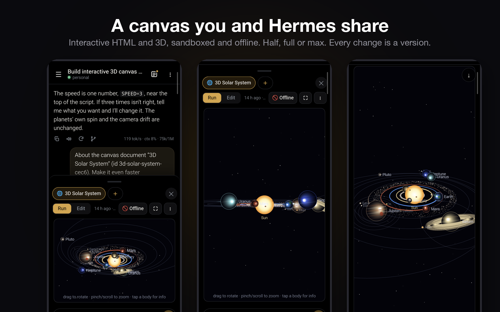
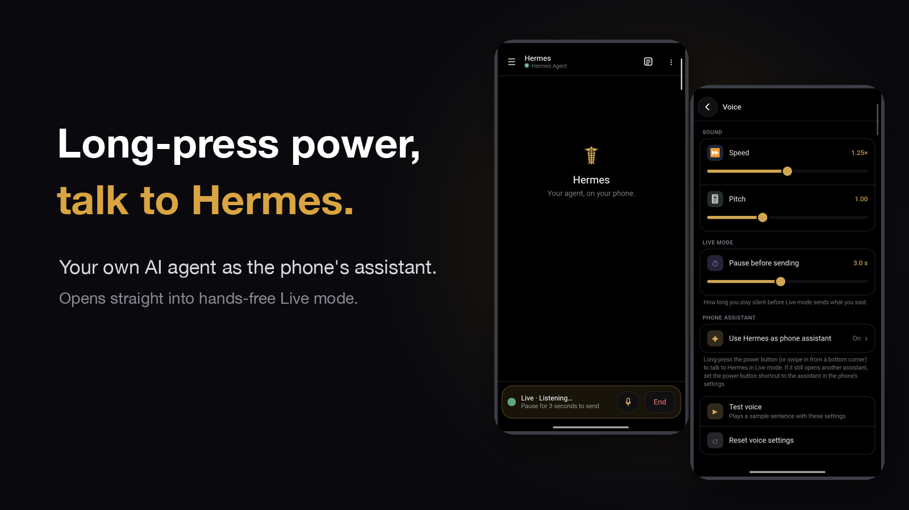
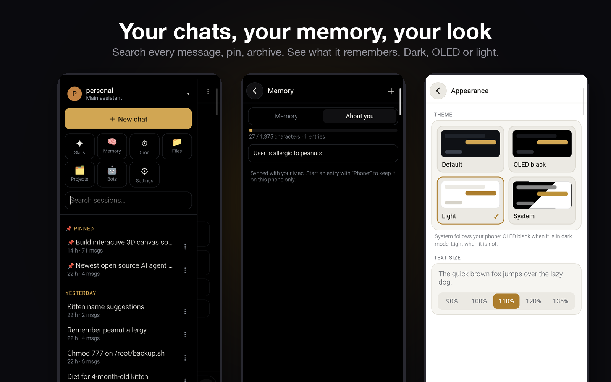
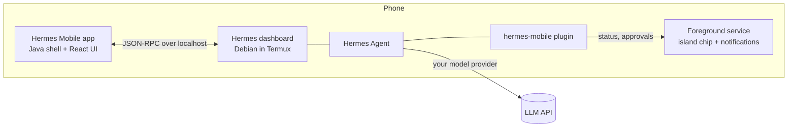

<p align="center">
  
</p>

<p align="center">
  <b>A native-feeling Android app for <a href="https://github.com/NousResearch/hermes-agent">Hermes Agent</a>, running entirely on your phone.</b><br>
  No laptop. No server.
</p>

<p align="center">
  
  
  
  
  
</p>

<p align="center">
  <a href="https://x.com/markkeeper2/status/2106873833978540280"></a><br>
  <a href="https://x.com/markkeeper2/status/2106873833978540280"><b>𝕏 See the demo release post</b></a>
</p>

> Unofficial community project. Not affiliated with or endorsed by Nous Research. Hermes itself is never patched.

## Why

Hermes Agent is a powerful agent, but it lives in a terminal. Hermes Mobile gives it a proper phone interface: streaming chat,
live tool cards, approvals you can answer from the status bar, a canvas for building things together, and notifications that work
while the app is closed. Hermes runs in Termux on the same phone, so the whole thing is self-contained.

## Highlights

### Answer from the island

Approvals and questions show up on the status chip (an Android 16 Live Update; older versions get a normal notification).
One tap on the chip, pick an answer, done. The app does not need to be open.

<p align="center"></p>

### Renders everything, natively

KaTeX equations, sortable tables with "Copy table", tick-able task lists, Obsidian-style callouts, Mermaid diagrams (full screen,
pinch to zoom), coloured diffs, long code that collapses, inline SVG and HTML cards.

<p align="center"></p>

### A canvas you and Hermes share

Ask for an interactive page or a 3D scene and Hermes builds it live in a document beside the chat. HTML runs in a sandbox that is offline
unless you allow it. Every change is a version with a diff you can restore.

<p align="center"></p>

### Your phone's assistant

Pick Hermes under Default apps → Digital assistant app and long-pressing the power button (or the assist gesture) opens it straight
in hands-free Live mode. Settings → Voice shows whether it is on.

<p align="center"></p>

### Your chats, your memory, your look

Search inside every message, pin, archive, link chats to chats. Every memory write is shown as a diff, and there is a screen to see
what Hermes remembers. Dark, OLED black or light.

<p align="center"></p>

### And more

| | |
|---|---|
| **Voice** | Read replies aloud (any installed TTS engine), dictation, a hands-free Live mode, and Hermes as your phone's assistant (long-press power → Live mode) |
| **Skills & commands** | `/` autocomplete for every skill and slash command |
| **Models** | Switch model and reasoning level per chat; defaults per profile |
| **Cron & files** | Cron jobs (edit, run, results), a file browser and projects |
| **Offline-friendly** | Messages typed offline send on reconnect; the last chat list is cached |
| **Share** | "Share to Hermes" from any app, attach photos, camera shots and files |

## How it fits together



The app talks to the same `tui_gateway` JSON-RPC connection that Hermes Desktop uses, so it needs no changes to Hermes. A small plugin
sends status and approval events to the app's notification service.

## Setup

### Easiest: one command, or let your AI agent do it

Plug your phone into a computer (Mac, Windows or Linux) and give any coding agent (Claude Code, Codex, Cursor, Gemini CLI…) this prompt:

```text
Read https://raw.githubusercontent.com/omarqaterge/hermes-mobile-app/main/AGENT_INSTALL.md and follow it to set up Hermes on my Android phone.
```

Or run the setup script yourself, no agent needed. **Mac / Linux** (Terminal):

```bash
curl -fsSL https://raw.githubusercontent.com/omarqaterge/hermes-mobile-app/main/tools/setup-phone.sh -o setup-phone.sh && bash setup-phone.sh
```

**Windows** (PowerShell):

```powershell
irm https://raw.githubusercontent.com/omarqaterge/hermes-mobile-app/main/tools/setup-phone.ps1 | iex
```

Either way it walks you through turning on USB debugging, then installs Termux, Debian, Hermes Agent, the plugin and the app by itself
(20-45 minutes, mostly waiting) and asks you for the model and its API key. You need an Android phone (arm64, Android 8+)
with ~6 GB free. The instructions are in [AGENT_INSTALL.md](AGENT_INSTALL.md) if you want to read what it will do.

> Honest note: the whole script was run end to end on a clean Android 15 emulator (install, model, app, first message
> reaching the model provider) and each piece was checked on the author's phone, but not yet on a brand-new real phone.
> If something fails, open an issue.

<details>
<summary><b>Install by hand instead</b> (only the phone, 3 steps, mostly waiting)</summary>

1. Install **[Termux](https://f-droid.org/packages/com.termux/)** from F-Droid (not the Play Store, that version is outdated).
2. Open Termux and paste:

   ```bash
   curl -fsSL https://raw.githubusercontent.com/omarqaterge/hermes-mobile-app/main/phone/bootstrap.sh -o hm.sh && bash hm.sh
   ```

   It installs Debian, Hermes Agent and the Hermes plugin, and starts Hermes. It takes 15-40 minutes: keep Termux open and the
   screen on until it prints `HMSETUP DONE`. Then set your model and key, for example with OpenRouter:

   ```bash
   bash hm.sh model openrouter anthropic/claude-sonnet-5-5 OPENROUTER_API_KEY=your-key
   ```

   (Other providers: `anthropic` + `ANTHROPIC_API_KEY`, `openai` + `OPENAI_API_KEY`, `gemini` + `GEMINI_API_KEY`.)
3. On the phone, download **hermes-mobile.apk** from the [latest release](https://github.com/omarqaterge/hermes-mobile-app/releases/latest),
   install it, open it and allow what it asks for. Say hi.

**Recommended:** set **battery to "Unrestricted"** for *Hermes Mobile* and *Termux* (on Xiaomi/HyperOS also turn on *Autostart*), or Android may kill them in the background.

</details>

<details>
<summary><b>Build the app yourself</b> (instead of the downloaded APK)</summary>

On a computer with **Node 20+**, **JDK 17** and the **[Android command-line tools](https://developer.android.com/studio#command-line-tools-only)**
(`sdkmanager "platforms;android-36" "build-tools;35.0.0"`), with the phone plugged in and USB debugging on:

```bash
git clone https://github.com/omarqaterge/hermes-mobile-app.git && cd hermes-mobile-app
(cd web && npm ci)
ANDROID_HOME=/path/to/android-sdk JAVA_HOME=/path/to/jdk-17 VERSION_NAME=1.0.0 VERSION_CODE=1 android/build.sh
adb install -r android/build/hermes-mobile.apk
```

The first build makes a signing key in `~/.android/hermes-mobile.keystore`. A self-built app can't be updated with the downloaded one (different key): uninstall it first.

</details>

### If something goes wrong

First open **Settings → Setup check** in the app (it also opens by itself when the app can't reach Hermes): it shows what's missing and has a button for each fix.

| What you see | Fix |
|---|---|
| "Hermes is offline" for more than a minute | Open Termux, run `~/bin/hermes-services`, go back to the app and tap Reconnect |
| Termux stops with `[Process completed (signal 9)]` during the install | Android 12+ killed it. Android 14+: Developer options → *Disable child process restrictions*; or use the setup script from a computer, which fixes this itself. Then run `bash hm.sh` again |
| The install stops with `HMSETUP FAIL <step>` | Read the error above it, fix it, run `bash hm.sh` again (finished parts are skipped). [AGENT_INSTALL.md](AGENT_INSTALL.md) step 6 lists the usual causes |
| No status chip / canvas / approvals | In Termux run `proot-distro login debian -- hermes plugins list` and check `hermes-mobile` says *enabled* (or run `bash hm.sh` again) |
| The app can't start Hermes | In Termux run `grep allow-external ~/.termux/termux.properties`, it must say `true`. Run `bash hm.sh` again, then restart Termux |
| Hermes's Google Calendar/Gmail script fails with `No module named googleapiclient` | In Termux run `proot-distro login debian -- apt-get install -y python3-googleapi python3-google-auth-oauthlib python3-google-auth-httplib2` (`bash hm.sh` does the same) |
| Everything stops after a while | Battery is restricted: see the recommended settings above |

Optional: install **Termux:Boot** and put `~/bin/hermes-services` in `~/.termux/boot/10-hermes` so Hermes starts after a reboot.

<details>
<summary><b>How it works in more detail, and the full feature list</b></summary>

### How it works

The app talks to the same engine Hermes Desktop uses. Hermes's dashboard, already running on the
phone at `127.0.0.1:9119`, exposes the `tui_gateway` JSON-RPC connection at `/api/ws`. The web
interface uses Hermes's own connection client from `apps/shared` (copied into `web/vendor`, pinned to
the Hermes commit in `web/vendor/hermes-shared/.hermes-commit`), so it speaks the protocol
exactly the way Desktop does, including lossless replay after a reconnect.

The Android part (`android/`) is a thin Java shell around a WebView. It loads the interface from the
app's own files, and does the few things a web page can't: it reads the dashboard's session token
(fresh on every connect, since Hermes mints a new one when it restarts), starts Hermes in Termux
through Termux's `RUN_COMMAND` service when it isn't running, posts notifications, opens the photo picker and camera, receives shares, streams media files, and
handles the keyboard, screen edges and back button. Hermes itself is not modified.

### What it covers (0.7.76)

Chat: streaming replies with Markdown, LaTeX (KaTeX), Mermaid diagrams (full screen, pinch to zoom),
highlighted code (collapse, wrap, copy, open in canvas), sortable tables, tick-able task lists, coloured
diffs, and images, video and audio from `MEDIA:` paths (streamed with seeking). Reasoning; tool cards
(live while running; old chats load stored output on demand); sub-agent cards; the to-do list and status
line; approvals, questions, and masked secret, sudo and one-time-code prompts; stop and steer a running
turn; edit, retry and branch a turn; slash commands and skills with instant autocomplete; attach photos,
camera shots and any file (PDF, documents, code); "Share to Hermes" from other apps; per-chat drafts;
a message typed while offline is sent on reconnect; turn stats (tok/s, context); a "compress" hint when
the context is nearly full; file checkpoints (see and undo Hermes's file changes); share a chat as
Markdown; tap a message for its time. Long chats draw only what's near the screen.

Voice: read replies aloud (any installed TTS engine, voice, speed, pitch), dictation, and Live mode, a
hands-free conversation (listen, send after a pause, read the reply, listen again).

Canvas: documents Hermes and you share per chat (Markdown, HTML, code, CSV, SVG, Mermaid…), with
version history, diffs, restore, and sandboxed HTML pages that run offline.

Chats: search (titles and full text, jumping to the matching message), unread dots and "time ago",
rename, pin, archive, delete, swipe right to archive and left to delete, long-press and drag to reorder
or to pin, and an Archived section.

Settings: themes (dark, OLED black, light, system), text size, voice, the default model per bot or for
all, every API key and every Hermes option. Bots (profiles): create (blank or cloned), rename, describe,
edit SOUL.md, pick the model, delete. Screens for skills, memory, cron jobs (edit, run, view results),
files and projects. Launcher shortcuts: New chat, Live mode, last chat. Phone assistant: pick Hermes under Default apps → Digital assistant app (Settings → Voice shows the state) and the assist gesture opens Live mode.

This app is the only front end: it has no messaging-channel (Telegram, Discord…) settings on purpose.

In the background a foreground service keeps a pinned status notification that becomes an Android 16
Live Update in the island / status bar while Hermes works, and posts app-branded notifications for replies
(reply from the notification), questions (answer from the notification), approvals (allow or deny from
the notification), skill and memory learning, and cron results. A small Hermes plugin
(`hermes-plugin/`) sends those events and serves the canvas, media streaming and a few other endpoints;
`phone/` holds the scripts that keep Hermes, cron and memory sync running on the phone.


</details>

## Building

The web interface lives in `web/` (React, TypeScript, Vite, built into one self-contained HTML file).
`VERSION_NAME=x.y.z VERSION_CODE=n android/build.sh` builds the web interface, compiles the Java shell with the Android SDK's own tools
(no Gradle), and signs the APK with a local key in `~/.android/hermes-mobile.keystore` (created on the first build; never committed). Install with
`adb install -r android/build/hermes-mobile.apk`.

For development in a desktop browser, forward the phone's dashboard with
`adb forward tcp:9119 tcp:9119`, run `python3 web/devserver.py`, and open `http://127.0.0.1:5180`.
The dev server hands the page a fresh session token the same way the Android bridge does, so the
token never appears in a URL.

## Tests

- `cd web && npm test`: unit tests of the text helpers (vitest).
- `tools/web-e2e/run.sh`: the built interface in headless Chromium against a mock Hermes (no phone needed).
- `python3 tools/test_canvas.py`, `python3 tools/test_media.py`: the plugin's canvas storage and media endpoint.
- `tools/java-check.sh`: compiles the Java shell without the Android SDK.
- `python3 tools/e2e.py`: end-to-end checks against the real phone (notifications, status, approvals).

GitHub Actions runs all but the last on every push.

## After a Hermes update

The protocol is internal to Hermes and can change. When the phone's Hermes is updated, copy its
`apps/shared/src` into `web/vendor/hermes-shared`, update `.hermes-commit`, run `npm run typecheck`
in `web/`, and rebuild.

## License and credits

MIT, see `LICENSE`. `web/vendor/hermes-shared` is copied from [NousResearch/hermes-agent](https://github.com/NousResearch/hermes-agent)
(MIT, Copyright Nous Research), see `THIRD_PARTY.md`. "Hermes" and the Hermes Agent name belong to their owners.

Contributions and bug reports are welcome: see [CONTRIBUTING.md](CONTRIBUTING.md). The tests in the Tests section run without a phone except `tools/e2e.py`.
