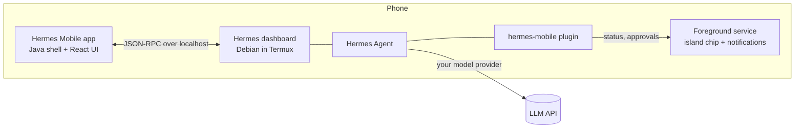

<p align="center">
  
</p>

<p align="center">
  <b>A native-feeling Android app for <a href="https://github.com/NousResearch/hermes-agent">Hermes Agent</a>, running entirely on your phone.</b><br>
  No laptop. No server.
</p>

<p align="center">
  
  
  
  
  
</p>

> Unofficial community project. Not affiliated with or endorsed by Nous Research. Hermes itself is never patched.

## Why

Hermes Agent is a powerful agent, but it lives in a terminal. Hermes Mobile gives it a proper phone interface: streaming chat,
live tool cards, approvals you can answer from the status bar, a canvas for building things together, and notifications that work
while the app is closed. Hermes runs in Termux on the same phone, so the whole thing is self-contained.

## Highlights

### Answer from the island

Approvals and questions show up on the status chip (an Android 16 Live Update; older versions get a normal notification).
One tap on the chip, pick an answer, done. The app does not need to be open.

<p align="center"></p>

### Renders everything, natively

KaTeX equations, sortable tables with "Copy table", tick-able task lists, Obsidian-style callouts, Mermaid diagrams (full screen,
pinch to zoom), coloured diffs, long code that collapses, inline SVG and HTML cards.

<p align="center"></p>

### A canvas you and Hermes share

Ask for an interactive page or a 3D scene and Hermes builds it live in a document beside the chat. HTML runs in a sandbox that is offline
unless you allow it. Every change is a version with a diff you can restore.

<p align="center"></p>

### Your chats, your memory, your look

Search inside every message, pin, archive, link chats to chats. Every memory write is shown as a diff, and there is a screen to see
what Hermes remembers. Dark, OLED black or light.

<p align="center"></p>

### And more

| | |
|---|---|
| **Voice** | Read replies aloud (any installed TTS engine), dictation, and a hands-free Live mode |
| **Skills & commands** | `/` autocomplete for every skill and slash command |
| **Models** | Switch model and reasoning level per chat; defaults per profile |
| **Cron & files** | Cron jobs (edit, run, results), a file browser and projects |
| **Offline-friendly** | Messages typed offline send on reconnect; the last chat list is cached |
| **Share** | "Share to Hermes" from any app, attach photos, camera shots and files |

## How it fits together



The app talks to the same `tui_gateway` JSON-RPC connection that Hermes Desktop uses, so it needs no changes to Hermes. A small plugin
sends status and approval events to the app's notification service.

## Setup

You need an Android phone (arm64) and a computer with a USB cable once, to install the app. About 20 minutes.

> Honest note: the author runs this on their own phone. The commands below were checked against that phone (`hermes plugins enable`, the dashboard flags, `allow-external-apps`), but the whole sequence has not been run on a clean phone. If a step fails, open an issue.

**1. Install Termux (on the phone).** Get [Termux](https://f-droid.org/packages/com.termux/) from F-Droid (not the Play Store). Optional: Termux:API.

**2. Install Debian and Hermes Agent inside Termux.** In Termux:

```bash
pkg update && pkg install proot-distro
proot-distro install debian
proot-distro login debian
```

Inside Debian, install Hermes Agent with Hermes's own instructions ([github.com/NousResearch/hermes-agent](https://github.com/NousResearch/hermes-agent)),
then run `hermes setup` and add your model provider / API key. Check that `hermes dashboard --host 127.0.0.1 --port 9119 --no-open` starts.

**3. Let the app start Hermes (in Termux, not Debian):**

```bash
mkdir -p ~/.termux && echo "allow-external-apps=true" >> ~/.termux/termux.properties
termux-reload-settings
```

**4. Get this repo onto the phone and install the plugin.** In Termux:

```bash
pkg install git
git clone https://github.com/omarqaterge/hermes-mobile-app.git ~/hermes-mobile
mkdir -p ~/bin && cp ~/hermes-mobile/phone/hermes-services ~/bin/ && chmod +x ~/bin/hermes-services
ROOT=$PREFIX/var/lib/proot-distro/containers/debian/rootfs/root
mkdir -p $ROOT/.hermes/plugins $ROOT/.hermes/scripts
cp -r ~/hermes-mobile/hermes-plugin/hermes-mobile $ROOT/.hermes/plugins/
cp ~/hermes-mobile/phone/cron_ticker.py $ROOT/.hermes/scripts/
proot-distro login debian -- hermes plugins enable hermes-mobile
```

**5. Build and install the app (on your computer).** Install Node 20+, JDK 17 and the Android command-line tools
(`sdkmanager "platforms;android-36" "build-tools;35.0.0"`), then, with the phone connected over USB debugging:

```bash
cd web && npm ci && cd ..
export ANDROID_HOME=/path/to/android-sdk JAVA_HOME=/path/to/jdk17
VERSION_NAME=1.0.0 VERSION_CODE=1 android/build.sh
adb install -r android/build/hermes-mobile.apk
```

The first build creates a local signing key in `~/.android/hermes-mobile.keystore`. Keep it: updates must be signed with the same key.

**6. First run.** Open the app and allow the permissions it asks for (notifications, Termux commands). It starts Hermes through Termux
and connects. If it says "Hermes is offline", open Termux and run `~/bin/hermes-services`, then tap Reconnect.
On Xiaomi/HyperOS and similar phones also allow Autostart and unrestricted battery for Hermes and Termux, or Android will kill them.

Optional: install Termux:Boot and make `~/.termux/boot/10-hermes` run `~/bin/hermes-services` so everything starts after a reboot.

<details>
<summary><b>How it works in more detail, and the full feature list</b></summary>

### How it works

The app talks to the same engine Hermes Desktop uses. Hermes's dashboard, already running on the
phone at `127.0.0.1:9119`, exposes the `tui_gateway` JSON-RPC connection at `/api/ws`. The web
interface uses Hermes's own connection client from `apps/shared` (copied into `web/vendor`, pinned to
the Hermes commit in `web/vendor/hermes-shared/.hermes-commit`), so it speaks the protocol
exactly the way Desktop does, including lossless replay after a reconnect.

The Android part (`android/`) is a thin Java shell around a WebView. It loads the interface from the
app's own files, and does the few things a web page can't: it reads the dashboard's session token
(fresh on every connect, since Hermes mints a new one when it restarts), starts Hermes in Termux
through Termux's `RUN_COMMAND` service when it isn't running, posts notifications, opens the photo picker and camera, receives shares, streams media files, and
handles the keyboard, screen edges and back button. Hermes itself is not modified.

### What it covers (0.7.76)

Chat: streaming replies with Markdown, LaTeX (KaTeX), Mermaid diagrams (full screen, pinch to zoom),
highlighted code (collapse, wrap, copy, open in canvas), sortable tables, tick-able task lists, coloured
diffs, and images, video and audio from `MEDIA:` paths (streamed with seeking). Reasoning; tool cards
(live while running; old chats load stored output on demand); sub-agent cards; the to-do list and status
line; approvals, questions, and masked secret, sudo and one-time-code prompts; stop and steer a running
turn; edit, retry and branch a turn; slash commands and skills with instant autocomplete; attach photos,
camera shots and any file (PDF, documents, code); "Share to Hermes" from other apps; per-chat drafts;
a message typed while offline is sent on reconnect; turn stats (tok/s, context); a "compress" hint when
the context is nearly full; file checkpoints (see and undo Hermes's file changes); share a chat as
Markdown; tap a message for its time. Long chats draw only what's near the screen.

Voice: read replies aloud (any installed TTS engine, voice, speed, pitch), dictation, and Live mode, a
hands-free conversation (listen, send after a pause, read the reply, listen again).

Canvas: documents Hermes and you share per chat (Markdown, HTML, code, CSV, SVG, Mermaid…), with
version history, diffs, restore, and sandboxed HTML pages that run offline.

Chats: search (titles and full text, jumping to the matching message), unread dots and "time ago",
rename, pin, archive, delete, swipe right to archive and left to delete, long-press and drag to reorder
or to pin, and an Archived section.

Settings: themes (dark, OLED black, light, system), text size, voice, the default model per bot or for
all, every API key and every Hermes option. Bots (profiles): create (blank or cloned), rename, describe,
edit SOUL.md, pick the model, delete. Screens for skills, memory, cron jobs (edit, run, view results),
files and projects. Launcher shortcuts: New chat, Live mode, last chat.

This app is the only front end: it has no messaging-channel (Telegram, Discord…) settings on purpose.

In the background a foreground service keeps a pinned status notification that becomes an Android 16
Live Update in the island / status bar while Hermes works, and posts app-branded notifications for replies
(reply from the notification), questions (answer from the notification), approvals (allow or deny from
the notification), skill and memory learning, and cron results. A small Hermes plugin
(`hermes-plugin/`) sends those events and serves the canvas, media streaming and a few other endpoints;
`phone/` holds the scripts that keep Hermes, cron and memory sync running on the phone.


</details>

## Building

The web interface lives in `web/` (React, TypeScript, Vite, built into one self-contained HTML file).
`VERSION_NAME=x.y.z VERSION_CODE=n android/build.sh` builds the web interface, compiles the Java shell with the Android SDK's own tools
(no Gradle), and signs the APK with a local key in `~/.android/hermes-mobile.keystore` (created on the first build; never committed). Install with
`adb install -r android/build/hermes-mobile.apk`.

For development in a desktop browser, forward the phone's dashboard with
`adb forward tcp:9119 tcp:9119`, run `python3 web/devserver.py`, and open `http://127.0.0.1:5180`.
The dev server hands the page a fresh session token the same way the Android bridge does, so the
token never appears in a URL.

## Tests

- `cd web && npm test`: unit tests of the text helpers (vitest).
- `tools/web-e2e/run.sh`: the built interface in headless Chromium against a mock Hermes (no phone needed).
- `python3 tools/test_canvas.py`, `python3 tools/test_media.py`: the plugin's canvas storage and media endpoint.
- `tools/java-check.sh`: compiles the Java shell without the Android SDK.
- `python3 tools/e2e.py`: end-to-end checks against the real phone (notifications, status, approvals).

GitHub Actions runs all but the last on every push.

## After a Hermes update

The protocol is internal to Hermes and can change. When the phone's Hermes is updated, copy its
`apps/shared/src` into `web/vendor/hermes-shared`, update `.hermes-commit`, run `npm run typecheck`
in `web/`, and rebuild.

## License and credits

MIT, see `LICENSE`. `web/vendor/hermes-shared` is copied from [NousResearch/hermes-agent](https://github.com/NousResearch/hermes-agent)
(MIT, Copyright Nous Research), see `THIRD_PARTY.md`. "Hermes" and the Hermes Agent name belong to their owners.

Contributions and bug reports are welcome. The tests in the Tests section run without a phone except `tools/e2e.py`.
